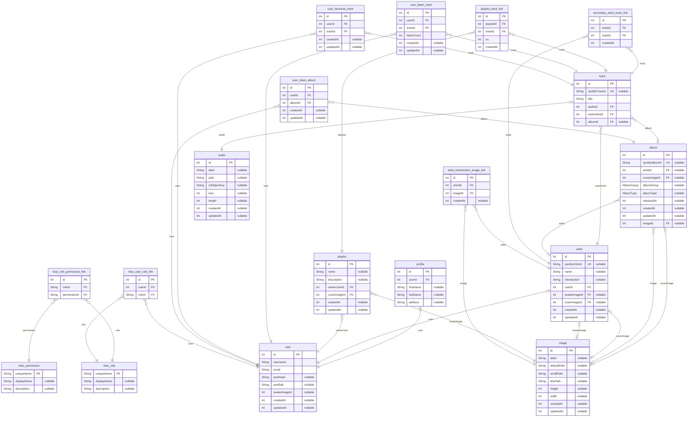

# Ongakool
> Generated by [`prisma-markdown`](https://github.com/samchon/prisma-markdown)

- [default](#default)

## default

### `user`

**Properties**
  - `id`: 
  - `username`: 
  - `email`: 
  - `pwdHash`: 
  - `pwdSalt`: 
  - `avatarImageId`: 
  - `createdAt`: 
  - `updatedAt`: 

### `profile`

**Properties**
  - `id`: 
  - `userId`: 
  - `firstName`: 
  - `lastName`: 
  - `address`: 

### `track`

**Properties**
  - `id`: 
  - `spotifyTrackId`: 
  - `title`: 
  - `audioId`: 
  - `mainArtistId`: 
  - `albumId`: 

### `album`

**Properties**
  - `id`: 
  - `spotifyAlbumId`: 
  - `artistId`: 
  - `coverImageId`: 
  - `albumGroup`: 
  - `albumType`: 
  - `releasedAt`: 
  - `createdAt`: 
  - `updatedAt`: 
  - `imageId`: 

### `artist`

**Properties**
  - `id`: 
  - `spotifyArtistId`: 
  - `name`: 
  - `introduction`: 
  - `userId`: 
  - `avatarImageId`: 
  - `coverImageId`: 
  - `createdAt`: 
  - `updatedAt`: 

### `playlist`

**Properties**
  - `id`: 
  - `name`: 
  - `description`: 
  - `ownerUserId`: 
  - `coverImageId`: 
  - `createdAt`: 
  - `updatedAt`: 

### `secondary_artist_track_link`

**Properties**
  - `id`: 
  - `artistId`: 
  - `trackId`: 
  - `createdAt`: 

### `playlist_track_link`

**Properties**
  - `id`: 
  - `playlistId`: 
  - `trackId`: 
  - `no`: 
  - `createdAt`: 

### `artist_introduction_image_link`

**Properties**
  - `id`: 
  - `artistId`: 
  - `imageId`: 
  - `createdAt`: 

### `image`

**Properties**
  - `id`: 
  - `label`: 
  - `defaultPath`: 
  - `smallPath`: 
  - `tinyPath`: 
  - `height`: 
  - `width`: 
  - `createdAt`: 
  - `updatedAt`: 

### `audio`

**Properties**
  - `id`: 
  - `label`: 
  - `path`: 
  - `s3ObjectKey`: 
  - `size`: In bytes
  - `length`: In seconds
  - `createdAt`: 
  - `updatedAt`: 

### `user_listen_track`

**Properties**
  - `id`: 
  - `userId`: 
  - `trackId`: 
  - `listenCount`: 
  - `createdAt`: 
  - `updatedAt`: 

### `user_favourite_track`

**Properties**
  - `id`: 
  - `userId`: 
  - `trackId`: 
  - `createdAt`: 
  - `updatedAt`: 

### `user_listen_album`

**Properties**
  - `id`: 
  - `userId`: 
  - `albumId`: 
  - `createdAt`: 
  - `updatedAt`: 

### `rbac_permission`

**Properties**
  - `uniqueName`: 
  - `displayName`: 
  - `description`: 

### `rbac_role`

**Properties**
  - `uniqueName`: 
  - `displayName`: 
  - `description`: 

### `rbac_role_permission_link`

**Properties**
  - `id`: 
  - `roleId`: 
  - `permissionId`: 

### `rbac_user_role_link`

**Properties**
  - `id`: 
  - `userId`: 
  - `roleId`: 